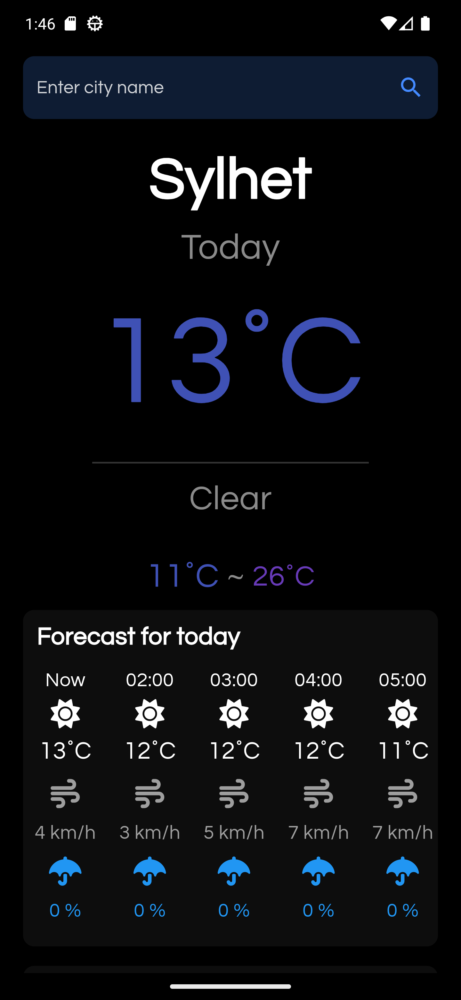
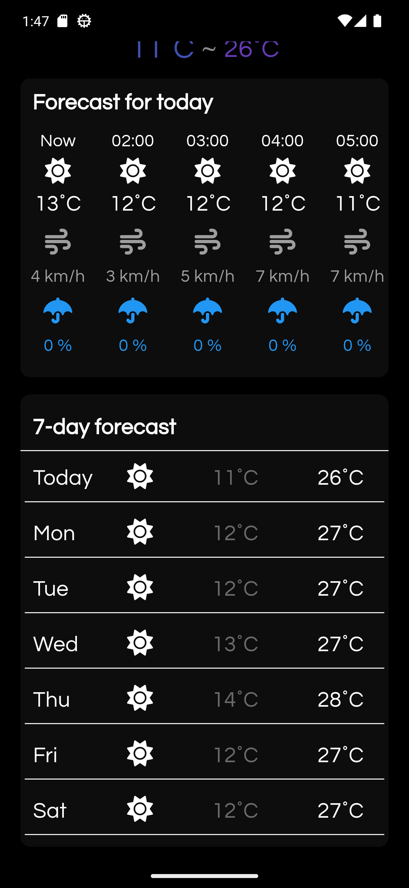
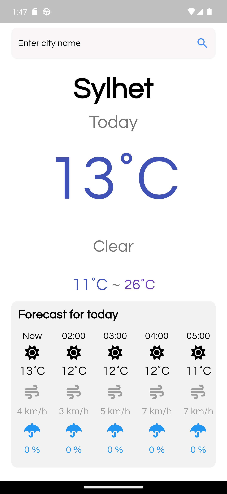

# Climatic ⛅

A modern weather application built with Flutter using MVVM architecture and Riverpod for state management. Get real-time weather updates, forecasts, and search for cities with a clean, responsive UI.

## 📱 Screenshots

<p align="center"> 
  
  
  
</p>

## ✨ Key Features

- 🌡️ Real-time weather data with current temperature
- 📅 Comprehensive 7-day weather forecast
- ⏰ Detailed hourly forecast for the current day
- 🔍 Intelligent city search with auto-suggestions
- 🌓 Seamless Dark/Light mode with system theme sync
- 📱 Responsive design optimized for all screen sizes
- ⚡ Fast and efficient data loading with caching
- 🛡️ Robust error handling and data validation

## 🏗️ Architecture

This project implements the MVVM (Model-View-ViewModel) architecture pattern for clean separation of concerns:

```
lib/
├── models/         # Data models and entities
├── views/          # UI components and screens
│   └── widgets/    # Reusable UI components
├── view_models/    # Business logic and state management
│   ├── states/     # State definitions
│   └── providers/  # Riverpod providers
└── services/       # API and external services
```

## 🛠️ Technology Stack

- **Flutter 3.x**: Modern UI framework for cross-platform development
- **Riverpod**: Robust state management solution
- **WeatherAPI**: Professional weather data provider
- **Google Fonts**: Premium typography
- **Font Awesome**: Comprehensive icon suite
- **HTTP**: Efficient network communication

## 🚀 Getting Started

1. **Clone the repository**
```bash
git clone https://github.com/zsifat/weather_app.git
```

2. **Install dependencies**
```bash
flutter pub get
```

3. **Configure WeatherAPI**
   - Sign up at [WeatherAPI](https://www.weatherapi.com/)
   - Get your API key from the dashboard
   - Add it to `lib/services/weather_service.dart`:
```dart
final String apiKey = 'YOUR_API_KEY';
```

4. **Run the application**
```bash
flutter run
```

## 🤝 Contributing

Contributions are welcome! Feel free to:

- Report bugs
- Suggest new features
- Submit pull requests

Please read our [Contributing Guidelines](CONTRIBUTING.md) for details.

## 📄 License

This project is licensed under the MIT License - see the [LICENSE](LICENSE) file for details.

## 👨‍💻 Author

**Sifat**
- GitHub: [@zsifat](https://github.com/zsifat)

## 🌟 Show your support

Give a ⭐️ if you like this project!

---

<p align="center">Made with ❤️ by Sifat</p>
